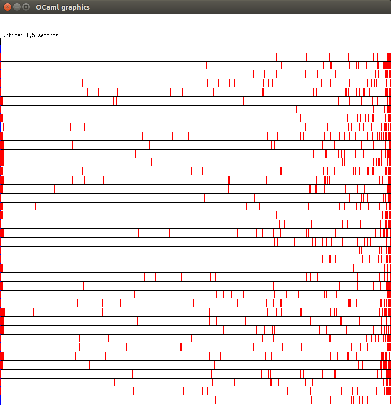

% PASL log visualizer
% Umut Acar, Arthur Charguéraud, Mike Rainey
% 13 August 2014

Introduction
============

For best results, run `make doc` and open `README.pdf`.	

Synopsis
========

pview [*PARAMETER*]...

Description
===========

`pview` helps to visualize the activity/idle time of processors
during a parallel run.

The input of pview program is a log file in binary format.  This log
file is generated when the option `--pview` (or `--log_phases`) is
enabled during the execution of the program.  

If you also log other events, it is likely that the log file will get 
too big and that the pview program will not be able to handle it.

The pview program is usually called without arguments, but you can
specify a different log file if you want.

Options
=======

Each *PARAMETER* can be one of the following.

`-input` *PATH*
:    Specify the path to the binary log file; default is `LOG_BIN`.

`-width` *n*
:    Specify the width in number of pixels of the window; default *n*=1000.

`-height` *n*
:    Specify the height in number of pixels of the window; default *n*=1000.

`-proc_height` *n*
:    Specify the height of a line describing one processor; default *n*=30. 

Display
=======

\

The width information shown initially near the top-left corner corresponds
to the runtime of the run associated with the `LOG` file.

Each processor shows up as a horizontal line. Every red rectangle corresponds
to idle periods.

Vertical blue lines correspond to the "phases", which are log events generated
from lines in the PASL code of the form:

	 LOG_BASIC(ALGO_PHASE);

Controls
========

The controls to be used in the program are:

- click to zoom-in
- spacebar to reinitialize zoom
- press 'o' to zoom-out one step
- press 'r' to reload the log file (for example, after a new run)
- press 'q' to quit.

By clicking and dragging the mouse from left to right, you can measure the 
width of the time interval associated with particular elements of the display.
The value is shown near the top-left corner.

Sample applications
===================

From the PASL root folder, run:

    cd example
    make -C ../tools/pview 
    make fib.log -j
    ./fib.log -n 45 -proc 2 --pview
    ../tools/pview/pview

For frequent use, you may add the pview folder to your path, e.g., adding the
following line to the bottom `~/.bashrc`:

    PATH=$PATH:~/pasl/tools/pview

Limitations
===========

There is a maximal size of `LOG` files that the current implementation of the
tool is able to handle. This limit depends on the machine.

See also
========

The PASL web page is located at
<http://deepsea.inria.fr/pasl/>

